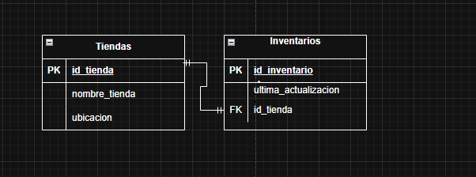

#  Prácticas de Diseño y Modelado de Bases de Datos

Este repositorio contiene una serie de ejercicios prácticos enfocados en el diseño lógico (MER) y la implementación física (SQL) de bases de datos utilizando **MySQL**.

##  Ejercicio 1: Relación 1 a 1 (Tiendas e Inventarios)

En este escenario, se modeló el sistema para un emprendimiento donde cada **Tienda** posee de forma exclusiva un único **Inventario**.

### Conceptos Aplicados:
*   **Integridad Referencial:** Implementación de llaves primarias y foráneas con tipos de datos optimizados (`TINYINT UNSIGNED`).
*   **Restricción de Unicidad:** Uso de la cláusula `UNIQUE` en la llave foránea para forzar la relación 1 a 1.
*   **Acciones Referenciales:** Uso de `ON DELETE CASCADE` para asegurar que, al eliminar una tienda, su inventario asociado también se elimine automáticamente.

### Diagrama Entidad-Relación (MER)

## 🛠️ Tecnologías utilizadas
*   **Motor de BD:** MySQL 8.0
*   **Modelado:** MySQL Workbench
*   **Entorno:** Windows 11 / VS Code
*   **Control de Versiones:** Git & GitHub

##  Sobre el autor
Actualmente me encuentro estudiando **Desarrollo Full-Stack**. Este proyecto forma parte de mi portafolio de aprendizaje en gestión de datos y lógica de programación.
